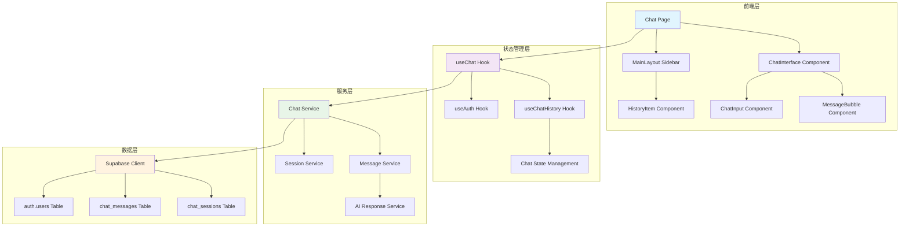
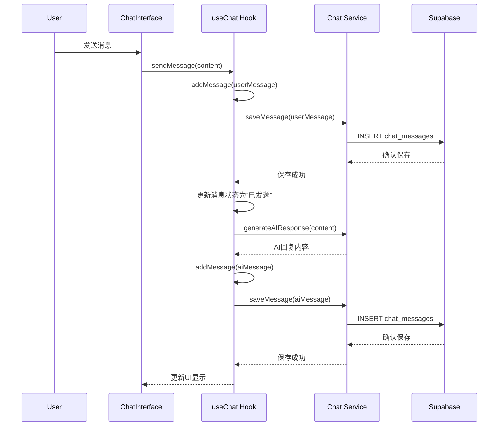

# AI对话功能设计文档

## 概述

本设计文档描述了EZWorking AI对话功能的技术架构和实现方案。该功能将提供类似ChatGPT的对话体验，支持多会话管理、消息持久化存储和智能回复系统。设计充分利用现有的Supabase基础设施和React组件架构，确保与现有系统的无缝集成。

## 架构

### 系统架构图



### 数据流架构



## 组件和接口

### 核心组件结构

#### 1. ChatPage 组件
- **职责**: 主聊天页面，处理URL路由和会话切换
- **状态管理**: 管理当前会话ID、加载状态、错误状态
- **URL格式**: `/chat?session={sessionId}`

```typescript
interface ChatPageProps {
  // 通过URL参数传递
  searchParams: { session?: string }
}

interface ChatPageState {
  isLoadingSession: boolean
  sessionError: string | null
  isInitialized: boolean
}
```

#### 2. ChatInterface 组件
- **职责**: 聊天界面核心组件，处理消息显示和输入
- **特性**: 消息列表、输入框、文件上传、状态指示器

```typescript
interface ChatInterfaceProps {
  messages: ChatMessage[]
  onSendMessage: (message: string) => void
  onRetryMessage?: (messageId: string) => void
  isLoading?: boolean
  userId?: string
}
```

#### 3. MainLayout Sidebar
- **职责**: 左侧边栏，显示历史对话列表和新建对话按钮
- **特性**: 对话历史、会话切换、删除对话

```typescript
interface SidebarProps {
  sessions: ChatSession[]
  currentSessionId: string | null
  onSessionSwitch: (sessionId: string) => void
  onSessionDelete: (sessionId: string) => void
  onNewSession: () => void
}
```

### 数据模型

#### ChatMessage 接口
```typescript
interface ChatMessage {
  id: string
  type: 'user' | 'assistant' | 'component'
  content: string
  componentType?: ComponentType
  componentData?: any
  timestamp: Date
  userId?: string
  status?: 'sending' | 'sent' | 'failed'
  retryCount?: number
}
```

#### ChatSession 接口
```typescript
interface ChatSession {
  id: string
  user_id: string
  title: string
  messages: ChatHistoryMessage[]
  created_at: Date
  updated_at: Date
}
```

#### ChatHistoryMessage 接口
```typescript
interface ChatHistoryMessage {
  role: 'user' | 'ai'
  content: string
  timestamp: Date
}
```

### 服务接口

#### ChatService
```typescript
interface ChatService {
  // 会话管理
  createSession(userId: string): Promise<string>
  getSession(sessionId: string): Promise<ChatSession | null>
  getUserSessions(userId: string): Promise<ChatSession[]>
  deleteSession(sessionId: string): Promise<void>
  
  // 消息管理
  saveMessage(sessionId: string, message: ChatHistoryMessage): Promise<void>
  getSessionMessages(sessionId: string): Promise<ChatHistoryMessage[]>
  
  // AI响应
  generateResponse(content: string): Promise<string>
}
```

## 数据模型

### 数据库表结构

#### chat_sessions 表
```sql
CREATE TABLE chat_sessions (
  id UUID PRIMARY KEY DEFAULT uuid_generate_v4(),
  user_id UUID NOT NULL REFERENCES auth.users(id) ON DELETE CASCADE,
  title VARCHAR(100) NOT NULL,
  created_at TIMESTAMP WITH TIME ZONE DEFAULT NOW(),
  updated_at TIMESTAMP WITH TIME ZONE DEFAULT NOW()
);
```

#### chat_messages 表
```sql
CREATE TABLE chat_messages (
  id UUID PRIMARY KEY DEFAULT uuid_generate_v4(),
  session_id UUID NOT NULL REFERENCES chat_sessions(id) ON DELETE CASCADE,
  role VARCHAR(10) NOT NULL CHECK (role IN ('user', 'ai')),
  content TEXT NOT NULL,
  timestamp TIMESTAMP WITH TIME ZONE DEFAULT NOW()
);
```

### 消息存储格式

消息在数据库中按照指定格式存储：
```json
{
  "messages": [
    {"role": "user", "content": "用户输入的内容"},
    {"role": "ai", "content": "AI回复的内容"},
    {"role": "user", "content": "用户的后续输入"},
    {"role": "ai", "content": "AI的后续回复"}
  ]
}
```

### 索引策略
- `idx_chat_sessions_user_id`: 按用户ID查询会话
- `idx_chat_sessions_created_at`: 按创建时间排序会话
- `idx_chat_messages_session_id`: 按会话ID查询消息
- `idx_chat_messages_timestamp`: 按时间戳排序消息

## 错误处理

### 错误类型和处理策略

#### 1. 认证错误
- **场景**: 用户未登录或token过期
- **处理**: 重定向到登录页面，显示友好提示

#### 2. 会话错误
- **场景**: 会话不存在、无访问权限、会话ID格式错误
- **处理**: 显示错误信息，自动创建新会话

#### 3. 网络错误
- **场景**: 网络连接失败、请求超时
- **处理**: 显示重试按钮，支持离线缓存

#### 4. 数据库错误
- **场景**: 保存消息失败、查询超时
- **处理**: 本地缓存消息，支持重试机制

### 错误恢复机制

```typescript
interface ErrorRecoveryStrategy {
  // 消息发送失败重试
  retryMessage: (messageId: string) => Promise<void>
  
  // 会话加载失败恢复
  recoverSession: (sessionId: string) => Promise<void>
  
  // 网络连接恢复
  reconnect: () => Promise<void>
  
  // 本地缓存同步
  syncLocalCache: () => Promise<void>
}
```

## 测试策略

### 单元测试

#### 1. Hook测试
- `useChat`: 消息发送、状态管理、错误处理
- `useChatHistory`: 会话管理、历史记录加载
- `useAuth`: 用户认证状态

#### 2. 组件测试
- `ChatInterface`: 消息显示、输入处理、文件上传
- `MessageBubble`: 消息渲染、状态指示器
- `HistoryItem`: 会话项显示、操作按钮

#### 3. 服务测试
- `ChatService`: API调用、数据转换、错误处理
- `MessageService`: 消息保存、格式转换
- `SessionService`: 会话CRUD操作

### 集成测试

#### 1. 端到端流程测试
- 用户登录 → 创建会话 → 发送消息 → 接收回复
- 会话切换 → 历史记录加载 → 消息同步
- 错误场景 → 重试机制 → 恢复正常

#### 2. 数据库集成测试
- Supabase连接测试
- RLS策略验证
- 数据一致性检查

### 性能测试

#### 1. 加载性能
- 会话列表加载时间 < 1秒
- 消息历史加载时间 < 2秒
- 会话切换响应时间 < 500ms

#### 2. 并发测试
- 多会话并发访问
- 大量消息处理
- 数据库连接池管理

## 安全考虑

### 数据安全

#### 1. 行级安全策略 (RLS)
```sql
-- 用户只能访问自己的会话
CREATE POLICY "Users can view own chat sessions" 
ON chat_sessions FOR SELECT 
USING (auth.uid()::text = user_id::text);

-- 用户只能访问自己会话中的消息
CREATE POLICY "Users can view own chat messages" 
ON chat_messages FOR SELECT 
USING (
  EXISTS (
    SELECT 1 FROM chat_sessions cs 
    WHERE cs.id = chat_messages.session_id 
    AND cs.user_id::text = auth.uid()::text
  )
);
```

#### 2. 输入验证
- 消息内容长度限制 (最大10000字符)
- 会话标题长度限制 (最大100字符)
- SQL注入防护
- XSS攻击防护

#### 3. 访问控制
- JWT token验证
- 会话权限检查
- API速率限制

### 隐私保护

#### 1. 数据加密
- 传输层加密 (HTTPS)
- 敏感数据字段加密
- 数据库连接加密

#### 2. 数据保留策略
- 会话自动清理 (可配置)
- 用户数据删除权限
- 审计日志记录

## 性能优化

### 前端优化

#### 1. 组件优化
- React.memo 防止不必要重渲染
- useMemo 缓存计算结果
- useCallback 缓存函数引用
- 虚拟滚动处理大量消息

#### 2. 状态管理优化
- 滚动式加载所有历史消息（无分页）
- 本地缓存会话数据
- 防抖处理用户输入
- 智能自动滚动（仅在用户接近底部时滚动）
- 乐观更新提升响应速度

#### 3. 网络优化
- 请求合并减少网络调用
- 缓存策略优化
- 离线支持和同步

### 后端优化

#### 1. 数据库优化
- 索引优化查询性能
- 连接池管理
- 查询优化和缓存
- 一次性加载会话消息，提供流畅滚动体验

#### 2. API优化
- 响应压缩
- 缓存策略
- 批量操作支持
- 异步处理长时间任务

## 部署和监控

### 部署策略

#### 1. 环境配置
- 开发环境: 本地Supabase实例
- 测试环境: 独立Supabase项目
- 生产环境: 生产Supabase项目

#### 2. 数据库迁移
- 版本化SQL脚本
- 自动化迁移流程
- 回滚策略

### 监控指标

#### 1. 业务指标
- 日活跃用户数
- 会话创建数量
- 消息发送成功率
- 平均会话时长

#### 2. 技术指标
- API响应时间
- 数据库查询性能
- 错误率和异常监控
- 系统资源使用率

#### 3. 用户体验指标
- 页面加载时间
- 消息发送延迟
- 会话切换速度
- 错误恢复时间