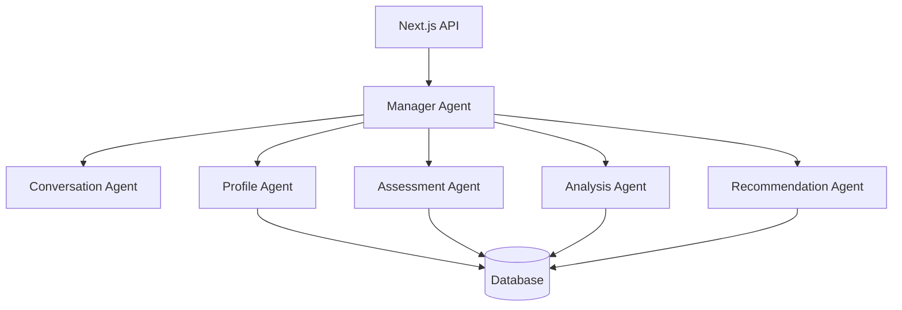

# AI协调系统设计文档

## Overview

简化的AI协调系统，核心是一个Manager Agent用AI分析用户意图，然后调用对应的专业Agent。保持CAMEL Workforce的智能协调机制，但去掉复杂的工作流管理。

## Architecture

### 简化架构



## Components and Interfaces

### 1. Manager Agent (核心协调器)

**简单的AI协调器，模仿Workforce的coordinator_agent**

```python
class ManagerAgent(ChatAgent):
    def __init__(self):
        system_message = BaseMessage.make_assistant_message(
            role_name="AI协调管理器",
            content="""你是一个AI协调管理器，分析用户意图并决定调用哪个专业Agent。
            
            可用的Agent：
            - conversation: 一般对话
            - profile: 收集用户信息
            - assessment: 进行测评
            - analysis: 分析用户画像  
            - recommendation: 推荐职位
            
            根据用户输入判断应该调用哪个Agent。"""
        )
        super().__init__(system_message)
        self.agents = {
            'conversation': ConversationAgent(),
            'profile': ProfileAgent(),
            'assessment': AssessmentAgent(), 
            'analysis': AnalysisAgent(),
            'recommendation': RecommendationAgent()
        }
    
    async def process_request(self, user_message: str, user_id: str) -> AsyncGenerator:
        """处理用户请求并返回流式响应"""
        # 1. AI分析用户意图
        intent = self._analyze_intent(user_message)
        
        # 2. 调用对应Agent
        agent = self.agents[intent.agent_type]
        
        # 3. 流式返回结果
        async for chunk in agent.stream_response(user_message, user_id):
            yield chunk
    
    def _analyze_intent(self, user_message: str) -> Intent:
        """用AI分析用户意图"""
        prompt = INTENT_ANALYSIS_PROMPT.format(user_message=user_message)
        response = self.step(prompt)
        return self._parse_intent(response)
```

### 2. 专业Agent基类

**统一的Agent接口**

```python
class BaseSpecializedAgent(ChatAgent):
    def __init__(self, role_name: str, system_content: str):
        system_message = BaseMessage.make_assistant_message(
            role_name=role_name,
            content=system_content
        )
        super().__init__(system_message)
    
    async def stream_response(self, user_message: str, user_id: str) -> AsyncGenerator:
        """流式响应，第一条包含type字段"""
        # 第一条消息包含type
        yield {
            "type": self.get_response_type(),
            "content": "开始处理..."
        }
        
        # 后续流式内容
        async for chunk in self._generate_response(user_message, user_id):
            yield {"content": chunk}
    
    def get_response_type(self) -> str:
        """返回响应类型：normal/form/recommendation/evaluation"""
        return "normal"
    
    async def _generate_response(self, user_message: str, user_id: str) -> AsyncGenerator:
        """子类实现具体的响应生成逻辑"""
        raise NotImplementedError
```

### 3. 核心Prompt

**简化的AI决策Prompt**

```python
INTENT_ANALYSIS_PROMPT = """
分析用户意图，决定调用哪个Agent：

用户输入：{user_message}

Agent选项：
- conversation: 一般对话、咨询
- profile: 要求填写信息、收集资料
- assessment: 要求测评、问卷
- analysis: 要求分析、评估
- recommendation: 要求推荐职位、建议

返回JSON：
{{
    "agent_type": "选择的agent",
    "reasoning": "选择理由"
}}
"""

## Data Models

### 1. 意图分析结果

```python
@dataclass
class Intent:
    agent_type: str  # conversation/profile/assessment/analysis/recommendation
    reasoning: str
```

### 2. 流式响应格式

```python
@dataclass
class StreamResponse:
    type: Optional[str]  # 只在第一条消息中包含
    content: str
    finished: Optional[bool]  # 结束标识
```

## Error Handling

### 1. 简单的重试机制

```python
class SimpleRetryHandler:
    def __init__(self, max_retries: int = 3):
        self.max_retries = max_retries
    
    async def execute_with_retry(self, agent_func, *args, **kwargs):
        """简单的重试逻辑"""
        for attempt in range(self.max_retries):
            try:
                return await agent_func(*args, **kwargs)
            except Exception as e:
                if attempt == self.max_retries - 1:
                    raise e
                await asyncio.sleep(1)  # 简单延迟
```

## Testing Strategy

### 1. 核心测试

- **意图分析测试**: 验证Manager Agent正确识别用户意图
- **Agent调用测试**: 验证正确调用对应的专业Agent
- **流式响应测试**: 验证流式输出格式正确
- **错误处理测试**: 验证重试机制工作正常

## 实现要点

### 1. 保持简单

- 只有一个Manager Agent做协调
- 用AI分析意图，不用复杂规则
- 简单的重试机制，不过度设计

### 2. 核心机制

- AI驱动的意图分析（模仿Workforce的coordinator）
- 专业Agent分工（模仿Workforce的worker）
- 流式响应支持（结合你的接口需求）