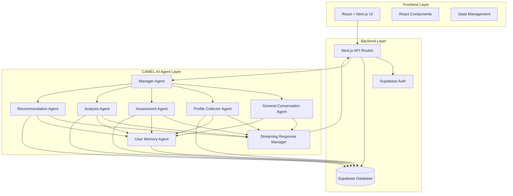
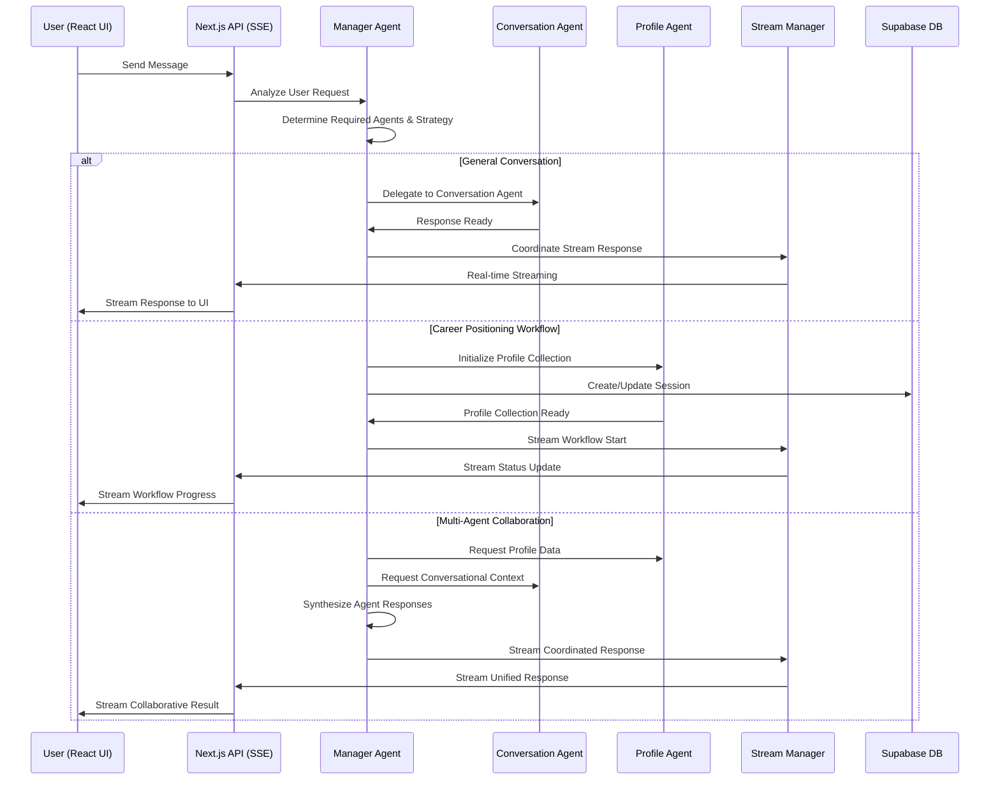
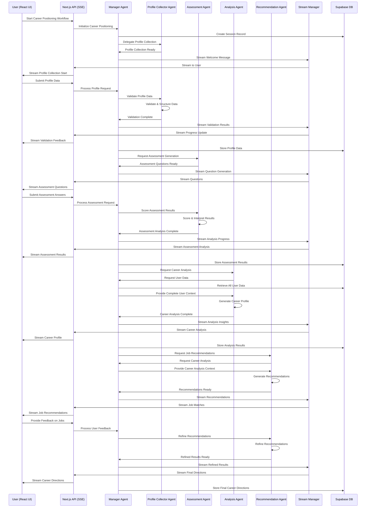

# Career Positioning Feature Design Document

## Overview

The Career Positioning feature implements an intelligent Multi-Agent system architecture using CAMEL.AI framework that combines structured workflows with flexible conversational AI. The system features an Intent Recognition Agent that routes users to appropriate specialized agents or workflows, while supporting real-time streaming responses. It consists of a React + Next.js frontend with Supabase backend, integrated with multiple CAMEL agents that work together to provide both structured career positioning workflows and general conversational assistance.

## Architecture

### System Architecture Overview



### Technology Stack

- **Frontend**: React 18+ with Next.js 14+ (App Router)
- **Backend**: Next.js API Routes with Supabase
- **Database**: Supabase (PostgreSQL)
- **Authentication**: Supabase Auth
- **AI Agents**: CAMEL.AI Framework
- **Real-time**: Supabase Realtime (for agent status updates) + Server-Sent Events (SSE)
- **UI Framework**: Hybrid GUI/LUI approach combining conversational and visual interfaces
- **Styling**: Tailwind CSS (based on existing codebase pattern)
- **Streaming**: Real-time token streaming with structured data rendering

### System Communication Flow

#### Manager Agent Coordination Flow


#### Manager Agent Orchestrated Workflow Flow


## Components and Interfaces

### Frontend Components (React + Next.js)

#### 1. Career Positioning Pages
```typescript
// app/(dashboard)/[workspace]/(app)/career-positioning/page.tsx
interface CareerPositioningPage {
  userId: string
  workspaceId: string
}

// Components structure - Hybrid GUI/LUI Interface
interface CareerPositioningComponents {
  ChatInterface: React.FC<ChatInterfaceProps>
  StreamingMessage: React.FC<StreamingMessageProps>
  AssessmentCard: React.FC<AssessmentCardProps>
  JobRecommendationCard: React.FC<JobRecommendationCardProps>
  AnalysisVisualization: React.FC<AnalysisVisualizationProps>
  InteractiveWorkflowCards: React.FC<WorkflowCardProps>
  ConversationalFeedback: React.FC<FeedbackProps>
}
```

#### 2. API Routes (Next.js) - Hybrid Response Format
```typescript
// app/api/career-positioning/chat/route.ts
interface ChatAPI {
  POST: (request: Request) => Promise<Response> // Send message with streaming response
}

// app/api/career-positioning/stream/route.ts
interface StreamingAPI {
  GET: (request: Request) => Promise<Response>  // SSE endpoint for real-time streaming
}

// Response format for hybrid UI
interface HybridResponse {
  type: 'conversation' | 'card' | 'mixed'
  content: {
    text?: string // For streaming conversational content
    cards?: CardData[] // For structured visual components
    metadata?: ResponseMetadata
  }
}

interface CardData {
  type: 'assessment' | 'job_recommendation' | 'analysis_chart'
  data: any
  actions?: CardAction[]
}
```

### Backend Integration (Supabase)

#### 1. Database Schema
```sql
-- User profiles table
CREATE TABLE user_profiles (
  id UUID PRIMARY KEY DEFAULT gen_random_uuid(),
  user_id UUID REFERENCES auth.users(id),
  basic_info JSONB,
  education JSONB,
  experience JSONB,
  skills JSONB,
  optional_info JSONB,
  created_at TIMESTAMP WITH TIME ZONE DEFAULT NOW(),
  updated_at TIMESTAMP WITH TIME ZONE DEFAULT NOW()
);

-- Assessment results table
CREATE TABLE assessment_results (
  id UUID PRIMARY KEY DEFAULT gen_random_uuid(),
  user_id UUID REFERENCES auth.users(id),
  session_id UUID,
  questions JSONB,
  answers JSONB,
  scores JSONB,
  created_at TIMESTAMP WITH TIME ZONE DEFAULT NOW()
);

-- Career analysis table
CREATE TABLE career_analysis (
  id UUID PRIMARY KEY DEFAULT gen_random_uuid(),
  user_id UUID REFERENCES auth.users(id),
  session_id UUID,
  personality_analysis JSONB,
  strengths_analysis JSONB,
  career_tendencies JSONB,
  created_at TIMESTAMP WITH TIME ZONE DEFAULT NOW()
);

-- Job recommendations table
CREATE TABLE job_recommendations (
  id UUID PRIMARY KEY DEFAULT gen_random_uuid(),
  user_id UUID REFERENCES auth.users(id),
  session_id UUID,
  recommendations JSONB,
  user_preferences JSONB,
  final_directions JSONB,
  created_at TIMESTAMP WITH TIME ZONE DEFAULT NOW()
);
```

### CAMEL.AI Agent Integration

#### 1. Manager Agent (CAMEL.AI)

**Purpose:** Coordinates and manages all specialized agents using CAMEL-AI's multi-agent framework

**CAMEL Implementation:**
```python
from camel.agents import ChatAgent
from camel.messages import BaseMessage
from camel.societies import RolePlaying
from camel.types import TaskType

class CareerPositioningManagerAgent(ChatAgent):
    def __init__(self):
        system_message = BaseMessage.make_assistant_message(
            role_name="Career Positioning Manager",
            content="You are a manager agent responsible for coordinating specialized career counseling agents to provide comprehensive career positioning assistance."
        )
        super().__init__(system_message)
        self.specialized_agents = self._initialize_specialized_agents()
        self.active_sessions = {}
    
    def _initialize_specialized_agents(self):
        return {
            'conversation': GeneralConversationAgent(),
            'profile_collector': ProfileCollectorAgent(),
            'assessment': AssessmentAgent(),
            'analysis': AnalysisAgent(),
            'recommendation': RecommendationAgent(),
            'memory': UserMemoryAgent()
        }
    
    def coordinate_request(self, user_message: str, user_id: str, context: dict) -> dict:
        # Analyze request and coordinate appropriate agents
        coordination_prompt = self._create_coordination_prompt(user_message, context)
        coordination_plan = self.step(coordination_prompt)
        
        # Execute coordination plan with specialized agents
        return self._execute_coordination_plan(coordination_plan, user_id, context)
    
    def orchestrate_workflow(self, workflow_type: str, user_id: str) -> dict:
        # Orchestrate multi-agent workflow using CAMEL societies
        if workflow_type == "career_positioning":
            return self._orchestrate_career_positioning_workflow(user_id)
    
    def _orchestrate_career_positioning_workflow(self, user_id: str):
        # Create role-playing society for career positioning
        task_prompt = "Complete comprehensive career positioning for user"
        
        # Coordinate agents in sequence with handoffs
        profile_result = self._coordinate_agent('profile_collector', user_id)
        assessment_result = self._coordinate_agent('assessment', user_id, profile_result)
        analysis_result = self._coordinate_agent('analysis', user_id, {
            'profile': profile_result,
            'assessment': assessment_result
        })
        recommendation_result = self._coordinate_agent('recommendation', user_id, analysis_result)
        
        return self._synthesize_final_result({
            'profile': profile_result,
            'assessment': assessment_result,
            'analysis': analysis_result,
            'recommendations': recommendation_result
        })
```

**Interface:**
```typescript
interface ManagerAgent {
  coordinateRequest(message: string, userId: string, context: ConversationContext): Promise<CoordinationResult>
  orchestrateWorkflow(workflowType: string, userId: string): Promise<WorkflowResult>
  delegateToAgent(agentType: AgentType, task: AgentTask): Promise<AgentResponse>
  synthesizeAgentResponses(responses: AgentResponse[]): Promise<UnifiedResponse>
  manageAgentHandoffs(fromAgent: AgentType, toAgent: AgentType, context: HandoffContext): Promise<void>
}
```

#### 2. General Conversation Agent (CAMEL.AI)

**Purpose:** Provides conversational assistance for general career-related queries

**CAMEL Implementation:**
```python
class GeneralConversationAgent(ChatAgent):
    def __init__(self):
        system_message = BaseMessage.make_assistant_message(
            role_name="Career Counselor",
            content="You are a friendly career counselor who provides helpful advice and guidance on career-related topics."
        )
        super().__init__(system_message)
    
    def generate_response_stream(self, user_message: str, context: dict):
        # Generate streaming conversational response
        response_prompt = self._create_conversation_prompt(user_message, context)
        for chunk in self.step_stream(response_prompt):
            yield chunk
```

**Interface:**
```typescript
interface GeneralConversationAgent {
  generateResponse(message: string, context: ConversationContext): AsyncGenerator<string>
  maintainContext(context: ConversationContext): void
  suggestWorkflows(userNeeds: string[]): WorkflowSuggestion[]
}
```

#### 3. User Memory Agent (CAMEL.AI)

**Purpose:** Maintains comprehensive user career memory and provides personalized context to other agents

**CAMEL Implementation:**
```python
from camel.memories import ChatMemory, VectorMemory
from camel.agents import ChatAgent

class UserMemoryAgent(ChatAgent):
    def __init__(self):
        system_message = BaseMessage.make_assistant_message(
            role_name="User Memory Manager",
            content="You are responsible for maintaining comprehensive user career profiles and providing personalized context to other agents."
        )
        super().__init__(system_message)
        self.chat_memory = ChatMemory()
        self.vector_memory = VectorMemory()
    
    def update_user_profile(self, user_id: str, profile_data: dict):
        # Update user's career profile in memory
        memory_record = self._create_memory_record(user_id, profile_data)
        self.chat_memory.write_records([memory_record])
        self.vector_memory.add(user_id, profile_data)
    
    def get_user_context(self, user_id: str) -> dict:
        # Retrieve comprehensive user context for other agents
        records = self.chat_memory.get_records(user_id)
        return self._synthesize_user_context(records)
    
    def update_job_preferences(self, user_id: str, preferences: dict):
        # Update user's job preferences and saved positions
        self._update_preference_memory(user_id, preferences)
    
    def track_progress(self, user_id: str, progress_data: dict):
        # Track user's interview progress, learning progress, etc.
        self._update_progress_memory(user_id, progress_data)
```

**Interface:**
```typescript
interface UserMemoryAgent {
  updateUserProfile(userId: string, profileData: UserProfileData): Promise<void>
  getUserContext(userId: string): Promise<UserContext>
  updateJobPreferences(userId: string, preferences: JobPreferences): Promise<void>
  trackProgress(userId: string, progressData: ProgressData): Promise<void>
  getSavedJobs(userId: string): Promise<SavedJob[]>
  getCareerInsights(userId: string): Promise<CareerInsights>
}
```

#### 4. Streaming Response Manager (CAMEL.AI)

**Purpose:** Manages real-time streaming of responses from all agents

**Implementation:**
```python
class StreamingResponseManager:
    def __init__(self):
        self.active_streams = {}
    
    def create_stream(self, session_id: str, agent_type: str):
        # Create new streaming session
        stream = StreamingSession(session_id, agent_type)
        self.active_streams[session_id] = stream
        return stream
    
    def stream_response(self, session_id: str, content: str, metadata: dict):
        # Stream content to frontend
        if session_id in self.active_streams:
            self.active_streams[session_id].send(content, metadata)
```

**Interface:**
```typescript
interface StreamingResponseManager {
  createStream(sessionId: string, agentType: string): StreamingSession
  streamResponse(sessionId: string, content: string, metadata: ResponseMetadata): void
  closeStream(sessionId: string): void
  getStreamStatus(sessionId: string): StreamStatus
}
```

#### 4. Multi-Agent Society Integration (CAMEL.AI)

**Purpose:** Implements CAMEL-AI's RolePlaying society for coordinated multi-agent interactions

**Implementation:**
```python
from camel.societies import RolePlaying
from camel.agents import ChatAgent
from camel.messages import BaseMessage
from camel.types import TaskType, RoleType

class CareerPositioningSociety:
    def __init__(self, manager_agent: CareerPositioningManagerAgent):
        self.manager_agent = manager_agent
        self.role_playing_sessions = {}
    
    def create_assessment_society(self, user_id: str, profile_context: dict):
        # Create role-playing society for assessment generation
        assistant_role_name = "Career Assessment Specialist"
        user_role_name = "Profile Analysis Assistant"
        
        task_prompt = f"""
        Generate personalized career assessment questions based on user profile:
        {profile_context}
        """
        
        assistant_inception_prompt = """
        You are a career assessment specialist who creates personalized questions
        to understand career preferences and personality traits.
        """
        
        user_inception_prompt = """
        You are assisting in creating the most relevant assessment questions
        based on the user's background and career goals.
        """
        
        role_play_session = RolePlaying(
            assistant_role_name=assistant_role_name,
            user_role_name=user_role_name,
            assistant_agent_kwargs=dict(
                system_message=BaseMessage.make_assistant_message(
                    role_name=assistant_role_name,
                    content=assistant_inception_prompt
                )
            ),
            user_agent_kwargs=dict(
                system_message=BaseMessage.make_assistant_message(
                    role_name=user_role_name,
                    content=user_inception_prompt
                )
            ),
            task_prompt=task_prompt,
            with_task_specify=True,
        )
        
        self.role_playing_sessions[f"{user_id}_assessment"] = role_play_session
        return role_play_session
    
    def create_analysis_society(self, user_id: str, combined_data: dict):
        # Create role-playing society for career analysis
        assistant_role_name = "Senior Career Analyst"
        user_role_name = "Data Synthesis Specialist"
        
        task_prompt = f"""
        Analyze comprehensive career data and generate insights:
        Profile: {combined_data.get('profile', {})}
        Assessment: {combined_data.get('assessment', {})}
        """
        
        # Similar implementation for analysis role-playing
        pass
    
    def execute_collaborative_analysis(self, session_key: str, max_iterations: int = 3):
        # Execute role-playing session for collaborative analysis
        if session_key in self.role_playing_sessions:
            session = self.role_playing_sessions[session_key]
            
            chat_turn_limit = max_iterations
            n = 0
            input_msg = session.init_chat()
            
            while n < chat_turn_limit:
                n += 1
                assistant_response, user_response = session.step(input_msg)
                
                if session.terminated:
                    break
                    
                input_msg = assistant_response
            
            return session.get_chat_history()
```

**Interface:**
```typescript
interface MultiAgentSociety {
  createAssessmentSociety(userId: string, profileContext: ProfileContext): Promise<RolePlayingSession>
  createAnalysisSociety(userId: string, combinedData: CombinedData): Promise<RolePlayingSession>
  executeCollaborativeAnalysis(sessionKey: string, maxIterations: number): Promise<ChatHistory>
  getActiveSessions(userId: string): Promise<ActiveSession[]>
}
```

### 2. Profile Collector Agent (CAMEL.AI)

**Purpose:** Collect and structure user profile information under Manager Agent coordination

**CAMEL Implementation:**
```python
from camel.agents import ChatAgent
from camel.messages import BaseMessage

class ProfileCollectorAgent(ChatAgent):
    def __init__(self, manager_agent=None):
        system_message = BaseMessage.make_assistant_message(
            role_name="Profile Collector Specialist",
            content="You are a specialized agent working under a Manager Agent to collect and structure user profile information for career positioning. You coordinate with the Manager Agent for all decisions and data sharing."
        )
        super().__init__(system_message)
        self.manager_agent = manager_agent
    
    def collect_and_validate_profile(self, form_data: dict, manager_context: dict) -> dict:
        # Validate profile data with Manager Agent oversight
        validation_prompt = self._create_validation_prompt(form_data, manager_context)
        response = self.step(validation_prompt)
        
        # Report back to Manager Agent
        validation_result = self._parse_validation_response(response)
        if self.manager_agent:
            self.manager_agent.receive_agent_update('profile_collector', validation_result)
        
        return validation_result
    
    def request_manager_guidance(self, issue: str, context: dict) -> dict:
        # Request guidance from Manager Agent for complex decisions
        if self.manager_agent:
            return self.manager_agent.provide_guidance('profile_collector', issue, context)
        return {}
    
    def collaborate_with_memory_agent(self, user_id: str, profile_data: dict):
        # Coordinate with Memory Agent through Manager Agent
        if self.manager_agent:
            self.manager_agent.coordinate_agent_collaboration(
                'profile_collector', 'memory', 
                {'action': 'store_profile', 'user_id': user_id, 'data': profile_data}
            )
```

**Interface:**
```typescript
interface ProfileCollectorAgent {
  collectBasicInfo(managerContext: ManagerContext): Promise<BasicProfileForm>
  validateProfileData(data: ProfileData, managerContext: ManagerContext): ValidationResult
  structureProfileData(rawData: FormData): StructuredProfile
  requestManagerGuidance(issue: string, context: any): Promise<ManagerGuidance>
  collaborateWithMemoryAgent(userId: string, profileData: ProfileData): Promise<void>
}
```

### 3. Assessment Agent (CAMEL.AI)

**Purpose:** Generate and conduct personality/career assessments under Manager Agent coordination

**CAMEL Implementation:**
```python
class AssessmentAgent(ChatAgent):
    def __init__(self, manager_agent=None):
        system_message = BaseMessage.make_assistant_message(
            role_name="Assessment Specialist",
            content="You are a specialized psychological assessment expert working under a Manager Agent. You create personalized career and personality assessments while coordinating with other agents through the Manager Agent."
        )
        super().__init__(system_message)
        self.manager_agent = manager_agent
    
    def generate_personalized_questions(self, profile_context: dict, manager_guidance: dict) -> list:
        # Generate questions with Manager Agent coordination
        generation_prompt = self._create_question_generation_prompt(profile_context, manager_guidance)
        response = self.step(generation_prompt)
        questions = self._parse_questions(response)
        
        # Report to Manager Agent
        if self.manager_agent:
            self.manager_agent.receive_agent_update('assessment', {
                'action': 'questions_generated',
                'count': len(questions),
                'context': profile_context
            })
        
        return questions
    
    def score_and_interpret(self, responses: list, collaborative_context: dict) -> dict:
        # Score with input from other agents via Manager Agent
        scoring_prompt = self._create_scoring_prompt(responses, collaborative_context)
        response = self.step(scoring_prompt)
        results = self._parse_assessment_results(response)
        
        # Coordinate with Analysis Agent through Manager Agent
        if self.manager_agent:
            self.manager_agent.coordinate_agent_collaboration(
                'assessment', 'analysis',
                {'assessment_results': results, 'user_responses': responses}
            )
        
        return results
    
    def collaborate_in_role_playing(self, society_session, profile_data: dict):
        # Participate in CAMEL role-playing society for collaborative assessment
        return society_session.participate_as_specialist(self, profile_data)
```

**Interface:**
```typescript
interface AssessmentAgent {
  generateQuestions(profileContext: ProfileContext, managerGuidance: ManagerGuidance): Promise<Question[]>
  conductAssessment(questions: Question[], collaborativeContext: CollaborativeContext): Promise<AssessmentSession>
  scoreAssessment(responses: Response[], collaborativeContext: CollaborativeContext): AssessmentResults
  interpretResults(scores: AssessmentResults): PersonalityProfile
  collaborateInRolePlaying(societySession: RolePlayingSession, profileData: ProfileData): Promise<CollaborativeResult>
}
```

### 4. Analysis Agent (CAMEL.AI)

**Purpose:** Synthesize profile and assessment data into career insights using CAMEL framework

**CAMEL Implementation:**
```python
class AnalysisAgent(ChatAgent):
    def __init__(self):
        system_message = BaseMessage.make_assistant_message(
            role_name="Career Analysis Expert",
            content="You are a senior career analyst who synthesizes personality, skills, and experience data to provide comprehensive career insights."
        )
        super().__init__(system_message)
    
    def generate_comprehensive_analysis(self, profile_data: dict, assessment_results: dict) -> dict:
        # Use CAMEL agent for deep career analysis
        analysis_prompt = self._create_analysis_prompt(profile_data, assessment_results)
        response = self.step(analysis_prompt)
        return self._parse_career_analysis(response)
    
    def identify_career_patterns(self, combined_data: dict) -> dict:
        # Use CAMEL agent to identify career tendencies and patterns
        pattern_prompt = self._create_pattern_analysis_prompt(combined_data)
        response = self.step(pattern_prompt)
        return self._parse_career_patterns(response)
```

**Interface:**
```typescript
interface AnalysisAgent {
  analyzePersonality(assessment: AssessmentResults): PersonalityAnalysis
  generateCareerProfile(profile: StructuredProfile, personality: PersonalityAnalysis): CareerProfile
  identifyStrengths(combinedData: CombinedUserData): StrengthAnalysis
  createCareerTendencies(analysis: ComprehensiveAnalysis): CareerTendencies
}
```

### 5. Recommendation Agent (CAMEL.AI)

**Purpose:** Generate job recommendations and finalize career directions using CAMEL framework

**CAMEL Implementation:**
```python
class RecommendationAgent(ChatAgent):
    def __init__(self):
        system_message = BaseMessage.make_assistant_message(
            role_name="Career Recommendation Specialist",
            content="You are a career recommendation expert who matches candidates with suitable job positions and career paths based on comprehensive analysis."
        )
        super().__init__(system_message)
    
    def generate_job_recommendations(self, career_analysis: dict) -> list:
        # Use CAMEL agent to generate personalized job recommendations
        recommendation_prompt = self._create_recommendation_prompt(career_analysis)
        response = self.step(recommendation_prompt)
        return self._parse_job_recommendations(response)
    
    def refine_based_on_feedback(self, initial_recommendations: list, user_feedback: dict) -> list:
        # Use CAMEL agent to refine recommendations based on user preferences
        refinement_prompt = self._create_refinement_prompt(initial_recommendations, user_feedback)
        response = self.step(refinement_prompt)
        return self._parse_refined_recommendations(response)
    
    def synthesize_final_directions(self, all_data: dict) -> list:
        # Use CAMEL agent to create final career directions
        synthesis_prompt = self._create_synthesis_prompt(all_data)
        response = self.step(synthesis_prompt)
        return self._parse_career_directions(response)
```

**Interface:**
```typescript
interface RecommendationAgent {
  generateInitialRecommendations(careerProfile: CareerProfile): JobRecommendation[]
  processUserFeedback(feedback: UserFeedback): RefinedRecommendations
  synthesizeCareerDirections(preferences: UserPreferences): CareerDirection[]
  finalizeRecommendations(directions: CareerDirection[]): FinalCareerPlan
}
```

## Data Models

### Core Data Structures

```typescript
// User Profile Data
interface StructuredProfile {
  basicInfo: {
    age: number
    gender: string
    currentLocation: string
    acceptableLocations: string[]
  }
  education: {
    level: EducationLevel
    school: string
    major: string
  }
  experience: {
    workExperience: WorkExperience[]
    internshipExperience: InternshipExperience[]
  }
  skills: {
    professionalSkills: string[]
    knowledgeAreas: string[]
  }
  optional: {
    mbti?: string
    interests?: string[]
  }
}

// Assessment Results
interface AssessmentResults {
  personalityScores: PersonalityScores
  careerPreferenceScores: CareerPreferenceScores
  responsePatterns: ResponsePattern[]
  completionMetrics: AssessmentMetrics
}

// Career Analysis
interface CareerProfile {
  personalityAnalysis: PersonalityAnalysis
  strengthsWeaknesses: StrengthAnalysis
  careerTendencies: CareerTendencies
  fitAnalysis: CareerFitAnalysis
  recommendationBasis: RecommendationReasoning
}

// Job Recommendations
interface JobRecommendation {
  positionTitle: string
  industry: string
  fitScore: number
  reasoning: string[]
  requirements: JobRequirement[]
  careerPath: CareerPath
}
```

### Integration Layer

#### 1. CAMEL Agent Service (Python)
```python
# services/camel_agent_service.py
from camel.agents import ChatAgent
from camel.societies import RolePlaying

class CAMELAgentService:
    def __init__(self):
        self.orchestrator = CareerPositioningOrchestrator()
    
    async def process_profile_data(self, user_id: str, profile_data: dict) -> dict:
        return await self.orchestrator.route_request({
            'type': 'profile_processing',
            'user_id': user_id,
            'data': profile_data
        })
    
    async def generate_assessment(self, user_id: str, profile_context: dict) -> dict:
        return await self.orchestrator.route_request({
            'type': 'assessment_generation',
            'user_id': user_id,
            'context': profile_context
        })
```

#### 2. Next.js API Integration
```typescript
// app/api/career-positioning/agents/route.ts
import { CAMELAgentService } from '@/services/camel_agent_service'

const agentService = new CAMELAgentService()

export async function POST(request: Request) {
  const { action, userId, data } = await request.json()
  
  switch (action) {
    case 'process_profile':
      return await agentService.process_profile_data(userId, data)
    case 'generate_assessment':
      return await agentService.generate_assessment(userId, data)
    case 'analyze_career':
      return await agentService.analyze_career_data(userId, data)
    case 'generate_recommendations':
      return await agentService.generate_recommendations(userId, data)
  }
}
```

#### 3. Real-time Updates (Supabase Realtime)
```typescript
// hooks/useCareerPositioningRealtime.ts
import { useEffect, useState } from 'react'
import { supabase } from '@/lib/supabase'

export function useCareerPositioningRealtime(sessionId: string) {
  const [agentStatus, setAgentStatus] = useState<AgentStatus>('idle')
  
  useEffect(() => {
    const channel = supabase
      .channel(`career-positioning-${sessionId}`)
      .on('postgres_changes', {
        event: 'UPDATE',
        schema: 'public',
        table: 'career_positioning_sessions',
        filter: `id=eq.${sessionId}`
      }, (payload) => {
        setAgentStatus(payload.new.agent_status)
      })
      .subscribe()
    
    return () => supabase.removeChannel(channel)
  }, [sessionId])
  
  return { agentStatus }
}
```

## Error Handling

### Agent-Level Error Handling

1. **Individual Agent Failures:**
   - Implement circuit breaker pattern for each agent
   - Graceful degradation when agents are unavailable
   - Automatic retry with exponential backoff

2. **Communication Failures:**
   - Message queue with persistence for inter-agent communication
   - Timeout handling for agent responses
   - Fallback mechanisms for critical operations

3. **Data Consistency:**
   - Transaction-like operations for shared memory updates
   - Conflict resolution for concurrent agent operations
   - Data validation at each agent boundary

### System-Level Error Recovery

```typescript
interface ErrorRecoveryStrategy {
  handleAgentFailure(agentType: AgentType, error: AgentError): RecoveryAction
  restoreSessionState(sessionId: string): Promise<SessionState>
  validateSystemConsistency(): Promise<ConsistencyReport>
  executeRecoveryPlan(plan: RecoveryPlan): Promise<RecoveryResult>
}
```

## Testing Strategy

### Unit Testing
- Individual agent logic testing
- Data model validation testing
- Communication protocol testing
- Error handling scenario testing

### Integration Testing
- Multi-agent workflow testing
- Shared memory consistency testing
- End-to-end user journey testing
- Performance and scalability testing

### Agent-Specific Testing

1. **Profile Collector Agent:**
   - Form validation testing
   - Data structuring accuracy
   - Edge case handling (incomplete data)

2. **Assessment Agent:**
   - Question generation quality
   - Scoring algorithm accuracy
   - Adaptive questioning logic

3. **Analysis Agent:**
   - Profile synthesis accuracy
   - Reasoning quality assessment
   - Consistency across different user types

4. **Recommendation Agent:**
   - Recommendation relevance scoring
   - Preference learning effectiveness
   - Career direction synthesis quality

### Multi-Agent System Testing

```typescript
interface SystemTestSuite {
  testAgentCommunication(): Promise<TestResult>
  testWorkflowCoordination(): Promise<TestResult>
  testErrorRecovery(): Promise<TestResult>
  testDataConsistency(): Promise<TestResult>
  testPerformanceUnderLoad(): Promise<TestResult>
}
```

## Performance Considerations

### Scalability Design
- Horizontal scaling of individual agents
- Load balancing for agent requests
- Caching strategies for frequently accessed data
- Asynchronous processing for non-blocking operations

### Optimization Strategies
- Agent response caching
- Predictive pre-loading of assessment questions
- Batch processing for analysis operations
- Memory-efficient data structures for shared state

### Monitoring and Metrics
- Agent performance metrics
- Communication latency tracking
- User experience metrics
- System resource utilization monitoring