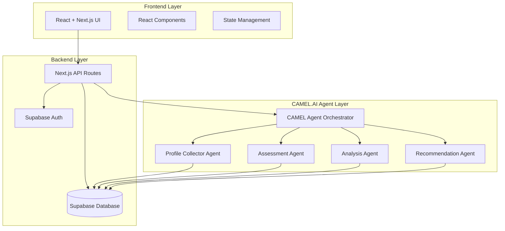
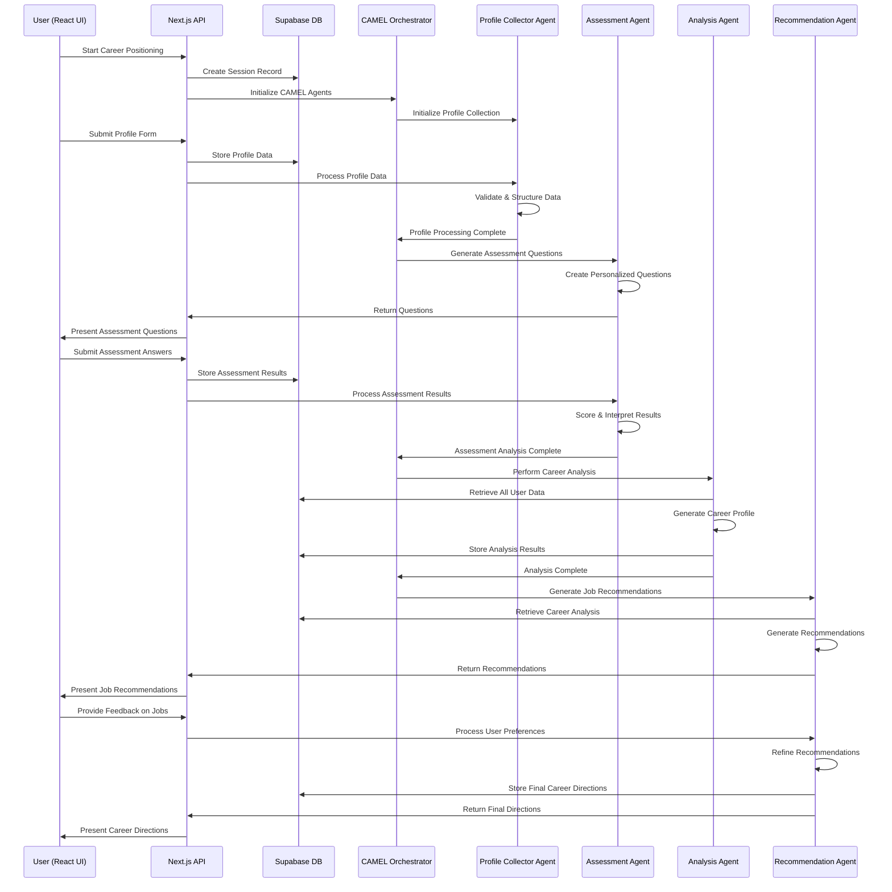

# Career Positioning Feature Design Document

## Overview

The Career Positioning feature implements a Multi-Agent system architecture using CAMEL.AI framework where specialized AI agents collaborate to provide comprehensive career guidance. The system consists of a React + Next.js frontend with Supabase backend, integrated with four primary CAMEL agents that work together through structured communication protocols to deliver personalized career positioning recommendations.

## Architecture

### System Architecture Overview



### Technology Stack

- **Frontend**: React 18+ with Next.js 14+ (App Router)
- **Backend**: Next.js API Routes with Supabase
- **Database**: Supabase (PostgreSQL)
- **Authentication**: Supabase Auth
- **AI Agents**: CAMEL.AI Framework
- **Real-time**: Supabase Realtime (for agent status updates)
- **Styling**: Tailwind CSS (based on existing codebase pattern)

### System Communication Flow



## Components and Interfaces

### Frontend Components (React + Next.js)

#### 1. Career Positioning Pages
```typescript
// app/(dashboard)/[workspace]/(app)/career-positioning/page.tsx
interface CareerPositioningPage {
  userId: string
  workspaceId: string
}

// Components structure
interface CareerPositioningComponents {
  ProfileForm: React.FC<ProfileFormProps>
  AssessmentQuiz: React.FC<AssessmentQuizProps>
  ProfileAnalysis: React.FC<ProfileAnalysisProps>
  JobRecommendations: React.FC<JobRecommendationsProps>
  CareerDirections: React.FC<CareerDirectionsProps>
}
```

#### 2. API Routes (Next.js)
```typescript
// app/api/career-positioning/route.ts
interface CareerPositioningAPI {
  POST: (request: Request) => Promise<Response> // Initialize session
  GET: (request: Request) => Promise<Response>  // Get session status
}

// app/api/career-positioning/profile/route.ts
interface ProfileAPI {
  POST: (request: Request) => Promise<Response> // Submit profile data
  PUT: (request: Request) => Promise<Response>  // Update profile
}

// app/api/career-positioning/assessment/route.ts
interface AssessmentAPI {
  GET: (request: Request) => Promise<Response>  // Get questions
  POST: (request: Request) => Promise<Response> // Submit answers
}
```

### Backend Integration (Supabase)

#### 1. Database Schema
```sql
-- User profiles table
CREATE TABLE user_profiles (
  id UUID PRIMARY KEY DEFAULT gen_random_uuid(),
  user_id UUID REFERENCES auth.users(id),
  basic_info JSONB,
  education JSONB,
  experience JSONB,
  skills JSONB,
  optional_info JSONB,
  created_at TIMESTAMP WITH TIME ZONE DEFAULT NOW(),
  updated_at TIMESTAMP WITH TIME ZONE DEFAULT NOW()
);

-- Assessment results table
CREATE TABLE assessment_results (
  id UUID PRIMARY KEY DEFAULT gen_random_uuid(),
  user_id UUID REFERENCES auth.users(id),
  session_id UUID,
  questions JSONB,
  answers JSONB,
  scores JSONB,
  created_at TIMESTAMP WITH TIME ZONE DEFAULT NOW()
);

-- Career analysis table
CREATE TABLE career_analysis (
  id UUID PRIMARY KEY DEFAULT gen_random_uuid(),
  user_id UUID REFERENCES auth.users(id),
  session_id UUID,
  personality_analysis JSONB,
  strengths_analysis JSONB,
  career_tendencies JSONB,
  created_at TIMESTAMP WITH TIME ZONE DEFAULT NOW()
);

-- Job recommendations table
CREATE TABLE job_recommendations (
  id UUID PRIMARY KEY DEFAULT gen_random_uuid(),
  user_id UUID REFERENCES auth.users(id),
  session_id UUID,
  recommendations JSONB,
  user_preferences JSONB,
  final_directions JSONB,
  created_at TIMESTAMP WITH TIME ZONE DEFAULT NOW()
);
```

### CAMEL.AI Agent Integration

#### 1. Agent Orchestrator (CAMEL.AI)

**Purpose:** Coordinates CAMEL agent workflow and manages system state

**Implementation:**
```python
from camel.agents import ChatAgent
from camel.societies import RolePlaying
from camel.messages import BaseMessage

class CareerPositioningOrchestrator:
    def __init__(self):
        self.agents = {
            'profile_collector': self._create_profile_agent(),
            'assessment': self._create_assessment_agent(),
            'analysis': self._create_analysis_agent(),
            'recommendation': self._create_recommendation_agent()
        }
    
    def initialize_session(self, user_id: str) -> dict:
        # Initialize CAMEL agents for user session
        pass
    
    def route_request(self, request: dict) -> dict:
        # Route to appropriate CAMEL agent
        pass
```

**Interface:**
```typescript
interface AgentOrchestrator {
  initializeSession(userId: string): Promise<SessionContext>
  routeRequest(request: UserRequest): Promise<AgentResponse>
  handleAgentTransition(fromAgent: AgentType, toAgent: AgentType): Promise<void>
  getSessionStatus(sessionId: string): SessionStatus
}
```

### 2. Profile Collector Agent (CAMEL.AI)

**Purpose:** Collect and structure user profile information using CAMEL framework

**CAMEL Implementation:**
```python
from camel.agents import ChatAgent
from camel.messages import BaseMessage

class ProfileCollectorAgent(ChatAgent):
    def __init__(self):
        system_message = BaseMessage.make_assistant_message(
            role_name="Profile Collector",
            content="You are a professional career counselor specializing in collecting and structuring user profile information for career positioning."
        )
        super().__init__(system_message)
    
    def collect_and_validate_profile(self, form_data: dict) -> dict:
        # Use CAMEL agent to validate and structure profile data
        validation_prompt = self._create_validation_prompt(form_data)
        response = self.step(validation_prompt)
        return self._parse_validation_response(response)
```

**Interface:**
```typescript
interface ProfileCollectorAgent {
  collectBasicInfo(): Promise<BasicProfileForm>
  validateProfileData(data: ProfileData): ValidationResult
  structureProfileData(rawData: FormData): StructuredProfile
  updateSharedContext(profile: StructuredProfile): Promise<void>
}
```

### 3. Assessment Agent (CAMEL.AI)

**Purpose:** Generate and conduct personality/career assessments using CAMEL framework

**CAMEL Implementation:**
```python
class AssessmentAgent(ChatAgent):
    def __init__(self):
        system_message = BaseMessage.make_assistant_message(
            role_name="Assessment Specialist",
            content="You are a psychological assessment expert who creates personalized career and personality assessments."
        )
        super().__init__(system_message)
    
    def generate_personalized_questions(self, profile_context: dict) -> list:
        # Use CAMEL agent to generate contextual assessment questions
        generation_prompt = self._create_question_generation_prompt(profile_context)
        response = self.step(generation_prompt)
        return self._parse_questions(response)
    
    def score_and_interpret(self, responses: list) -> dict:
        # Use CAMEL agent for intelligent scoring and interpretation
        scoring_prompt = self._create_scoring_prompt(responses)
        response = self.step(scoring_prompt)
        return self._parse_assessment_results(response)
```

**Interface:**
```typescript
interface AssessmentAgent {
  generateQuestions(profileContext: ProfileContext): Promise<Question[]>
  conductAssessment(questions: Question[]): Promise<AssessmentSession>
  scoreAssessment(responses: Response[]): AssessmentResults
  interpretResults(scores: AssessmentResults): PersonalityProfile
}
```

### 4. Analysis Agent (CAMEL.AI)

**Purpose:** Synthesize profile and assessment data into career insights using CAMEL framework

**CAMEL Implementation:**
```python
class AnalysisAgent(ChatAgent):
    def __init__(self):
        system_message = BaseMessage.make_assistant_message(
            role_name="Career Analysis Expert",
            content="You are a senior career analyst who synthesizes personality, skills, and experience data to provide comprehensive career insights."
        )
        super().__init__(system_message)
    
    def generate_comprehensive_analysis(self, profile_data: dict, assessment_results: dict) -> dict:
        # Use CAMEL agent for deep career analysis
        analysis_prompt = self._create_analysis_prompt(profile_data, assessment_results)
        response = self.step(analysis_prompt)
        return self._parse_career_analysis(response)
    
    def identify_career_patterns(self, combined_data: dict) -> dict:
        # Use CAMEL agent to identify career tendencies and patterns
        pattern_prompt = self._create_pattern_analysis_prompt(combined_data)
        response = self.step(pattern_prompt)
        return self._parse_career_patterns(response)
```

**Interface:**
```typescript
interface AnalysisAgent {
  analyzePersonality(assessment: AssessmentResults): PersonalityAnalysis
  generateCareerProfile(profile: StructuredProfile, personality: PersonalityAnalysis): CareerProfile
  identifyStrengths(combinedData: CombinedUserData): StrengthAnalysis
  createCareerTendencies(analysis: ComprehensiveAnalysis): CareerTendencies
}
```

### 5. Recommendation Agent (CAMEL.AI)

**Purpose:** Generate job recommendations and finalize career directions using CAMEL framework

**CAMEL Implementation:**
```python
class RecommendationAgent(ChatAgent):
    def __init__(self):
        system_message = BaseMessage.make_assistant_message(
            role_name="Career Recommendation Specialist",
            content="You are a career recommendation expert who matches candidates with suitable job positions and career paths based on comprehensive analysis."
        )
        super().__init__(system_message)
    
    def generate_job_recommendations(self, career_analysis: dict) -> list:
        # Use CAMEL agent to generate personalized job recommendations
        recommendation_prompt = self._create_recommendation_prompt(career_analysis)
        response = self.step(recommendation_prompt)
        return self._parse_job_recommendations(response)
    
    def refine_based_on_feedback(self, initial_recommendations: list, user_feedback: dict) -> list:
        # Use CAMEL agent to refine recommendations based on user preferences
        refinement_prompt = self._create_refinement_prompt(initial_recommendations, user_feedback)
        response = self.step(refinement_prompt)
        return self._parse_refined_recommendations(response)
    
    def synthesize_final_directions(self, all_data: dict) -> list:
        # Use CAMEL agent to create final career directions
        synthesis_prompt = self._create_synthesis_prompt(all_data)
        response = self.step(synthesis_prompt)
        return self._parse_career_directions(response)
```

**Interface:**
```typescript
interface RecommendationAgent {
  generateInitialRecommendations(careerProfile: CareerProfile): JobRecommendation[]
  processUserFeedback(feedback: UserFeedback): RefinedRecommendations
  synthesizeCareerDirections(preferences: UserPreferences): CareerDirection[]
  finalizeRecommendations(directions: CareerDirection[]): FinalCareerPlan
}
```

## Data Models

### Core Data Structures

```typescript
// User Profile Data
interface StructuredProfile {
  basicInfo: {
    age: number
    gender: string
    currentLocation: string
    acceptableLocations: string[]
  }
  education: {
    level: EducationLevel
    school: string
    major: string
  }
  experience: {
    workExperience: WorkExperience[]
    internshipExperience: InternshipExperience[]
  }
  skills: {
    professionalSkills: string[]
    knowledgeAreas: string[]
  }
  optional: {
    mbti?: string
    interests?: string[]
  }
}

// Assessment Results
interface AssessmentResults {
  personalityScores: PersonalityScores
  careerPreferenceScores: CareerPreferenceScores
  responsePatterns: ResponsePattern[]
  completionMetrics: AssessmentMetrics
}

// Career Analysis
interface CareerProfile {
  personalityAnalysis: PersonalityAnalysis
  strengthsWeaknesses: StrengthAnalysis
  careerTendencies: CareerTendencies
  fitAnalysis: CareerFitAnalysis
  recommendationBasis: RecommendationReasoning
}

// Job Recommendations
interface JobRecommendation {
  positionTitle: string
  industry: string
  fitScore: number
  reasoning: string[]
  requirements: JobRequirement[]
  careerPath: CareerPath
}
```

### Integration Layer

#### 1. CAMEL Agent Service (Python)
```python
# services/camel_agent_service.py
from camel.agents import ChatAgent
from camel.societies import RolePlaying

class CAMELAgentService:
    def __init__(self):
        self.orchestrator = CareerPositioningOrchestrator()
    
    async def process_profile_data(self, user_id: str, profile_data: dict) -> dict:
        return await self.orchestrator.route_request({
            'type': 'profile_processing',
            'user_id': user_id,
            'data': profile_data
        })
    
    async def generate_assessment(self, user_id: str, profile_context: dict) -> dict:
        return await self.orchestrator.route_request({
            'type': 'assessment_generation',
            'user_id': user_id,
            'context': profile_context
        })
```

#### 2. Next.js API Integration
```typescript
// app/api/career-positioning/agents/route.ts
import { CAMELAgentService } from '@/services/camel_agent_service'

const agentService = new CAMELAgentService()

export async function POST(request: Request) {
  const { action, userId, data } = await request.json()
  
  switch (action) {
    case 'process_profile':
      return await agentService.process_profile_data(userId, data)
    case 'generate_assessment':
      return await agentService.generate_assessment(userId, data)
    case 'analyze_career':
      return await agentService.analyze_career_data(userId, data)
    case 'generate_recommendations':
      return await agentService.generate_recommendations(userId, data)
  }
}
```

#### 3. Real-time Updates (Supabase Realtime)
```typescript
// hooks/useCareerPositioningRealtime.ts
import { useEffect, useState } from 'react'
import { supabase } from '@/lib/supabase'

export function useCareerPositioningRealtime(sessionId: string) {
  const [agentStatus, setAgentStatus] = useState<AgentStatus>('idle')
  
  useEffect(() => {
    const channel = supabase
      .channel(`career-positioning-${sessionId}`)
      .on('postgres_changes', {
        event: 'UPDATE',
        schema: 'public',
        table: 'career_positioning_sessions',
        filter: `id=eq.${sessionId}`
      }, (payload) => {
        setAgentStatus(payload.new.agent_status)
      })
      .subscribe()
    
    return () => supabase.removeChannel(channel)
  }, [sessionId])
  
  return { agentStatus }
}
```

## Error Handling

### Agent-Level Error Handling

1. **Individual Agent Failures:**
   - Implement circuit breaker pattern for each agent
   - Graceful degradation when agents are unavailable
   - Automatic retry with exponential backoff

2. **Communication Failures:**
   - Message queue with persistence for inter-agent communication
   - Timeout handling for agent responses
   - Fallback mechanisms for critical operations

3. **Data Consistency:**
   - Transaction-like operations for shared memory updates
   - Conflict resolution for concurrent agent operations
   - Data validation at each agent boundary

### System-Level Error Recovery

```typescript
interface ErrorRecoveryStrategy {
  handleAgentFailure(agentType: AgentType, error: AgentError): RecoveryAction
  restoreSessionState(sessionId: string): Promise<SessionState>
  validateSystemConsistency(): Promise<ConsistencyReport>
  executeRecoveryPlan(plan: RecoveryPlan): Promise<RecoveryResult>
}
```

## Testing Strategy

### Unit Testing
- Individual agent logic testing
- Data model validation testing
- Communication protocol testing
- Error handling scenario testing

### Integration Testing
- Multi-agent workflow testing
- Shared memory consistency testing
- End-to-end user journey testing
- Performance and scalability testing

### Agent-Specific Testing

1. **Profile Collector Agent:**
   - Form validation testing
   - Data structuring accuracy
   - Edge case handling (incomplete data)

2. **Assessment Agent:**
   - Question generation quality
   - Scoring algorithm accuracy
   - Adaptive questioning logic

3. **Analysis Agent:**
   - Profile synthesis accuracy
   - Reasoning quality assessment
   - Consistency across different user types

4. **Recommendation Agent:**
   - Recommendation relevance scoring
   - Preference learning effectiveness
   - Career direction synthesis quality

### Multi-Agent System Testing

```typescript
interface SystemTestSuite {
  testAgentCommunication(): Promise<TestResult>
  testWorkflowCoordination(): Promise<TestResult>
  testErrorRecovery(): Promise<TestResult>
  testDataConsistency(): Promise<TestResult>
  testPerformanceUnderLoad(): Promise<TestResult>
}
```

## Performance Considerations

### Scalability Design
- Horizontal scaling of individual agents
- Load balancing for agent requests
- Caching strategies for frequently accessed data
- Asynchronous processing for non-blocking operations

### Optimization Strategies
- Agent response caching
- Predictive pre-loading of assessment questions
- Batch processing for analysis operations
- Memory-efficient data structures for shared state

### Monitoring and Metrics
- Agent performance metrics
- Communication latency tracking
- User experience metrics
- System resource utilization monitoring