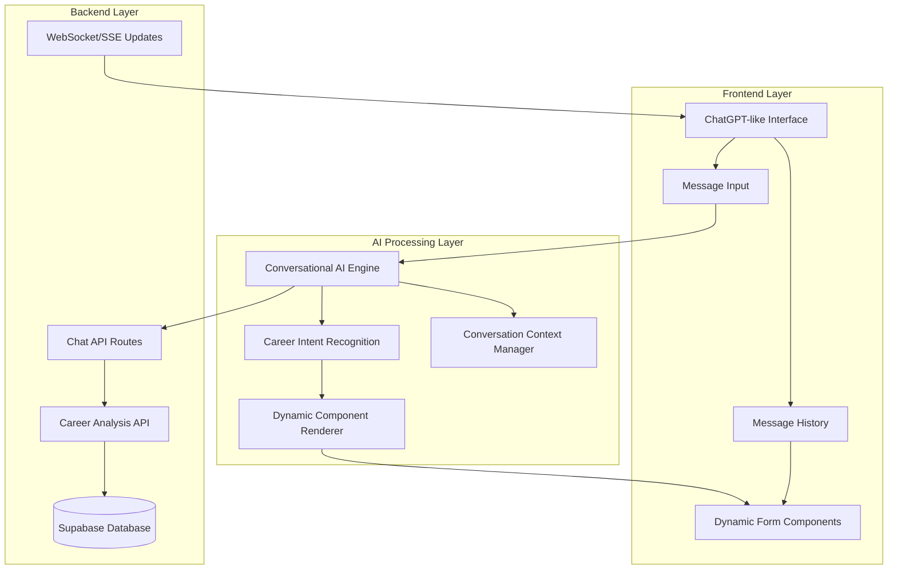
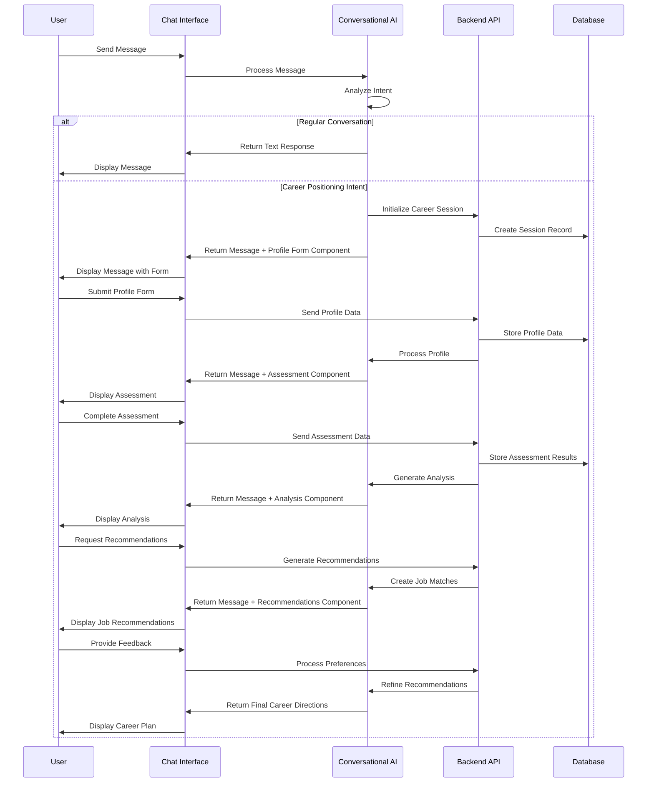

# Career Positioning Feature Design Document

## Overview

The Career Positioning feature is built as a ChatGPT-like conversational interface where users engage in natural dialogue with an AI assistant. The system dynamically renders interactive components (forms, assessments, analysis displays) within chat messages when career positioning analysis is needed. The architecture prioritizes conversational flow while providing structured data collection and intelligent career guidance capabilities.

## Architecture

### System Architecture Overview



### Technology Stack

- **Frontend**: React + Next.js with ChatGPT-like interface using Chakra UI
- **Chat System**: Real-time messaging with WebSocket/Server-Sent Events
- **AI Integration**: OpenAI API or similar for conversational AI
- **Backend**: Next.js API Routes with Supabase
- **Database**: Supabase (PostgreSQL) for chat history and career data
- **Authentication**: Supabase Auth
- **Real-time**: Supabase Realtime for live chat updates
- **Styling**: Chakra UI for consistent design system

### System Communication Flow



## Components and Interfaces

### Frontend Components (React + Next.js)

#### 1. Chat Interface Components
```typescript
// Main chat interface
interface ChatInterface {
  messages: ChatMessage[]
  onSendMessage: (message: string) => void
  isLoading: boolean
  userId: string
}

// Chat message types
interface ChatMessage {
  id: string
  type: 'user' | 'assistant' | 'component'
  content: string
  component?: ComponentType
  timestamp: Date
  userId: string
}

// Dynamic component types
type ComponentType = 
  | 'profile-form'
  | 'assessment-quiz' 
  | 'analysis-display'
  | 'job-recommendations'
  | 'career-directions'

// Interactive components that render within chat messages
interface InteractiveComponents {
  ProfileFormComponent: React.FC<ProfileFormProps>
  AssessmentComponent: React.FC<AssessmentProps>
  AnalysisComponent: React.FC<AnalysisProps>
  RecommendationsComponent: React.FC<RecommendationsProps>
  CareerDirectionsComponent: React.FC<CareerDirectionsProps>
}
```

#### 2. API Routes (Next.js)
```typescript
// app/api/chat/route.ts
interface ChatAPI {
  POST: (request: Request) => Promise<Response> // Send message
  GET: (request: Request) => Promise<Response>  // Get chat history
}

// app/api/chat/stream/route.ts
interface StreamingChatAPI {
  POST: (request: Request) => Promise<Response> // Streaming responses
}

// app/api/career/profile/route.ts
interface CareerProfileAPI {
  POST: (request: Request) => Promise<Response> // Submit profile data
  GET: (request: Request) => Promise<Response>  // Get profile data
}

// app/api/career/assessment/route.ts
interface AssessmentAPI {
  POST: (request: Request) => Promise<Response> // Submit assessment
  GET: (request: Request) => Promise<Response>  // Get assessment results
}

// app/api/career/analysis/route.ts
interface AnalysisAPI {
  POST: (request: Request) => Promise<Response> // Generate analysis
  GET: (request: Request) => Promise<Response>  // Get analysis results
}
```

### Backend Integration (Supabase)

#### 1. Database Schema
```sql
-- Chat conversations table
CREATE TABLE chat_conversations (
  id UUID PRIMARY KEY DEFAULT gen_random_uuid(),
  user_id UUID REFERENCES auth.users(id),
  title TEXT,
  created_at TIMESTAMP WITH TIME ZONE DEFAULT NOW(),
  updated_at TIMESTAMP WITH TIME ZONE DEFAULT NOW()
);

-- Chat messages table
CREATE TABLE chat_messages (
  id UUID PRIMARY KEY DEFAULT gen_random_uuid(),
  conversation_id UUID REFERENCES chat_conversations(id),
  user_id UUID REFERENCES auth.users(id),
  type TEXT CHECK (type IN ('user', 'assistant', 'component')),
  content TEXT,
  component_type TEXT,
  component_data JSONB,
  created_at TIMESTAMP WITH TIME ZONE DEFAULT NOW()
);

-- Career positioning sessions table
CREATE TABLE career_sessions (
  id UUID PRIMARY KEY DEFAULT gen_random_uuid(),
  user_id UUID REFERENCES auth.users(id),
  conversation_id UUID REFERENCES chat_conversations(id),
  status TEXT DEFAULT 'active',
  current_phase TEXT,
  profile_data JSONB,
  assessment_data JSONB,
  analysis_data JSONB,
  recommendations_data JSONB,
  created_at TIMESTAMP WITH TIME ZONE DEFAULT NOW(),
  updated_at TIMESTAMP WITH TIME ZONE DEFAULT NOW()
);

-- User career profiles table
CREATE TABLE user_career_profiles (
  id UUID PRIMARY KEY DEFAULT gen_random_uuid(),
  user_id UUID REFERENCES auth.users(id),
  session_id UUID REFERENCES career_sessions(id),
  basic_info JSONB,
  education JSONB,
  experience JSONB,
  skills JSONB,
  preferences JSONB,
  created_at TIMESTAMP WITH TIME ZONE DEFAULT NOW(),
  updated_at TIMESTAMP WITH TIME ZONE DEFAULT NOW()
);

-- Assessment results table
CREATE TABLE assessment_results (
  id UUID PRIMARY KEY DEFAULT gen_random_uuid(),
  user_id UUID REFERENCES auth.users(id),
  session_id UUID REFERENCES career_sessions(id),
  questions JSONB,
  answers JSONB,
  scores JSONB,
  personality_profile JSONB,
  created_at TIMESTAMP WITH TIME ZONE DEFAULT NOW()
);

-- Career analysis table
CREATE TABLE career_analysis (
  id UUID PRIMARY KEY DEFAULT gen_random_uuid(),
  user_id UUID REFERENCES auth.users(id),
  session_id UUID REFERENCES career_sessions(id),
  personality_analysis JSONB,
  strengths_analysis JSONB,
  career_tendencies JSONB,
  job_fit_analysis JSONB,
  created_at TIMESTAMP WITH TIME ZONE DEFAULT NOW()
);

-- Job recommendations table
CREATE TABLE job_recommendations (
  id UUID PRIMARY KEY DEFAULT gen_random_uuid(),
  user_id UUID REFERENCES auth.users(id),
  session_id UUID REFERENCES career_sessions(id),
  initial_recommendations JSONB,
  user_feedback JSONB,
  refined_recommendations JSONB,
  final_career_directions JSONB,
  created_at TIMESTAMP WITH TIME ZONE DEFAULT NOW()
);
```

### AI Integration and Processing

#### 1. Conversational AI Engine

**Purpose:** Handle natural language conversation and intent recognition

**Implementation:**
```typescript
// AI service for conversational responses
interface ConversationalAI {
  processMessage(message: string, context: ConversationContext): Promise<AIResponse>
  recognizeCareerIntent(message: string): Promise<CareerIntent>
  generateResponse(intent: Intent, context: Context): Promise<string>
  maintainContext(conversationId: string, newContext: Context): Promise<void>
}

// AI response with potential component rendering
interface AIResponse {
  message: string
  shouldRenderComponent?: boolean
  componentType?: ComponentType
  componentData?: any
  conversationContext: ConversationContext
}
```

#### 2. Career Analysis Engine

**Purpose:** Process career data and generate insights

**Implementation:**
```typescript
// Career analysis service
interface CareerAnalysisEngine {
  analyzeProfile(profileData: ProfileData): Promise<ProfileAnalysis>
  generateAssessment(profileContext: ProfileData): Promise<AssessmentQuestions>
  scoreAssessment(responses: AssessmentResponse[]): Promise<AssessmentResults>
  synthesizeCareerProfile(profile: ProfileData, assessment: AssessmentResults): Promise<CareerProfile>
  generateJobRecommendations(careerProfile: CareerProfile): Promise<JobRecommendation[]>
  refineRecommendations(recommendations: JobRecommendation[], feedback: UserFeedback): Promise<JobRecommendation[]>
}
```

#### 3. Dynamic Component System

**Purpose:** Render interactive components within chat messages

**Implementation:**
```typescript
// Component renderer for chat messages
interface ComponentRenderer {
  renderComponent(type: ComponentType, data: any, messageId: string): React.ReactElement
  handleComponentSubmission(componentId: string, data: any): Promise<void>
  updateComponentState(componentId: string, newState: any): void
}

// Component types that can be rendered in chat
type ComponentType = 
  | 'profile-form'
  | 'assessment-quiz'
  | 'analysis-display'
  | 'job-recommendations'
  | 'career-directions'
  | 'loading-indicator'
  | 'error-display'
```

## Data Models

### Core Data Structures

```typescript
// Chat message structure
interface ChatMessage {
  id: string
  conversationId: string
  userId: string
  type: 'user' | 'assistant' | 'component'
  content: string
  componentType?: ComponentType
  componentData?: any
  timestamp: Date
  metadata?: MessageMetadata
}

// Conversation context
interface ConversationContext {
  conversationId: string
  userId: string
  currentPhase?: 'general' | 'career-positioning'
  careerSessionId?: string
  messageHistory: ChatMessage[]
  userProfile?: Partial<ProfileData>
  assessmentProgress?: AssessmentProgress
  analysisResults?: CareerAnalysis
}

// User profile data structure
interface ProfileData {
  basicInfo: {
    age: number
    gender: string
    currentLocation: string
    acceptableLocations: string[]
  }
  education: {
    level: EducationLevel
    school: string
    major: string
    graduationYear?: number
  }
  experience: {
    workExperience: WorkExperience[]
    internshipExperience: InternshipExperience[]
    totalYearsExperience: number
  }
  skills: {
    professionalSkills: string[]
    knowledgeAreas: string[]
    certifications?: string[]
  }
  preferences: {
    mbti?: string
    interests?: string[]
    careerGoals?: string[]
    workEnvironmentPreferences?: string[]
  }
}

// Assessment structure
interface AssessmentQuestions {
  id: string
  questions: Question[]
  estimatedTime: number
  categories: AssessmentCategory[]
}

interface Question {
  id: string
  text: string
  type: 'multiple-choice' | 'rating-scale' | 'ranking'
  options?: string[]
  category: string
  required: boolean
}

// Assessment results
interface AssessmentResults {
  sessionId: string
  responses: QuestionResponse[]
  scores: {
    personality: PersonalityScores
    careerPreferences: CareerPreferenceScores
    workStyle: WorkStyleScores
  }
  completionTime: number
  completionDate: Date
}

// Career analysis results
interface CareerAnalysis {
  personalityProfile: {
    traits: PersonalityTrait[]
    strengths: string[]
    developmentAreas: string[]
    workingStyle: WorkingStyleProfile
  }
  careerFit: {
    suitableRoles: string[]
    industries: string[]
    workEnvironments: string[]
    careerPaths: CareerPath[]
  }
  recommendations: {
    immediate: string[]
    shortTerm: string[]
    longTerm: string[]
  }
}

// Job recommendations
interface JobRecommendation {
  id: string
  title: string
  company?: string
  industry: string
  location: string
  fitScore: number
  matchReasons: string[]
  requirements: JobRequirement[]
  salaryRange?: SalaryRange
  careerProgression: string[]
  userFeedback?: 'interested' | 'not-interested' | 'maybe'
}

// Career directions
interface CareerDirection {
  id: string
  title: string
  description: string
  suitabilityScore: number
  requiredSkills: string[]
  recommendedActions: ActionItem[]
  timeframe: string
  careerProgression: CareerStep[]
  resources: Resource[]
}
```

### Integration Layer

#### 1. Chat Service Integration
```typescript
// services/chat-service.ts
interface ChatService {
  sendMessage(conversationId: string, message: string): Promise<ChatMessage>
  getConversationHistory(conversationId: string): Promise<ChatMessage[]>
  createConversation(userId: string, title?: string): Promise<Conversation>
  streamResponse(message: string, context: ConversationContext): AsyncGenerator<string>
}

// AI service integration
class AIService {
  async processMessage(message: string, context: ConversationContext): Promise<AIResponse> {
    // Integrate with OpenAI or similar service
    const intent = await this.recognizeIntent(message, context)
    
    if (intent.type === 'career-positioning') {
      return await this.handleCareerIntent(intent, context)
    }
    
    return await this.generateConversationalResponse(message, context)
  }
  
  private async handleCareerIntent(intent: CareerIntent, context: ConversationContext): Promise<AIResponse> {
    // Determine which component to render based on career positioning phase
    const phase = this.determineCareerPhase(context)
    
    switch (phase) {
      case 'profile-collection':
        return {
          message: "I'd like to learn more about your background. Please fill out this profile form:",
          shouldRenderComponent: true,
          componentType: 'profile-form',
          componentData: await this.generateProfileForm(context)
        }
      case 'assessment':
        return {
          message: "Now let's do a quick assessment to understand your personality and preferences:",
          shouldRenderComponent: true,
          componentType: 'assessment-quiz',
          componentData: await this.generateAssessment(context)
        }
      // ... other phases
    }
  }
}
```

#### 2. Real-time Updates (Supabase Realtime)
```typescript
// hooks/useChatRealtime.ts
import { useEffect, useState } from 'react'
import { supabase } from '@/lib/supabase'

export function useChatRealtime(conversationId: string) {
  const [messages, setMessages] = useState<ChatMessage[]>([])
  const [isTyping, setIsTyping] = useState(false)
  
  useEffect(() => {
    const channel = supabase
      .channel(`chat-${conversationId}`)
      .on('postgres_changes', {
        event: 'INSERT',
        schema: 'public',
        table: 'chat_messages',
        filter: `conversation_id=eq.${conversationId}`
      }, (payload) => {
        setMessages(prev => [...prev, payload.new as ChatMessage])
      })
      .on('presence', { event: 'sync' }, () => {
        // Handle typing indicators
      })
      .subscribe()
    
    return () => supabase.removeChannel(channel)
  }, [conversationId])
  
  return { messages, isTyping }
}

// hooks/useCareerSession.ts
export function useCareerSession(sessionId?: string) {
  const [session, setSession] = useState<CareerSession | null>(null)
  const [isLoading, setIsLoading] = useState(false)
  
  const updateSession = async (data: Partial<CareerSession>) => {
    if (!sessionId) return
    
    setIsLoading(true)
    try {
      const { data: updatedSession } = await supabase
        .from('career_sessions')
        .update(data)
        .eq('id', sessionId)
        .select()
        .single()
      
      setSession(updatedSession)
    } catch (error) {
      console.error('Error updating career session:', error)
    } finally {
      setIsLoading(false)
    }
  }
  
  return { session, updateSession, isLoading }
}
```

#### 3. Component Integration System
```typescript
// components/chat/ComponentRenderer.tsx
interface ComponentRendererProps {
  message: ChatMessage
  onComponentSubmit: (componentId: string, data: any) => void
}

export function ComponentRenderer({ message, onComponentSubmit }: ComponentRendererProps) {
  const renderComponent = () => {
    switch (message.componentType) {
      case 'profile-form':
        return (
          <ProfileFormComponent
            data={message.componentData}
            onSubmit={(data) => onComponentSubmit(message.id, data)}
          />
        )
      case 'assessment-quiz':
        return (
          <AssessmentComponent
            questions={message.componentData.questions}
            onComplete={(results) => onComponentSubmit(message.id, results)}
          />
        )
      case 'analysis-display':
        return (
          <AnalysisComponent
            analysis={message.componentData}
            onInteraction={(interaction) => onComponentSubmit(message.id, interaction)}
          />
        )
      case 'job-recommendations':
        return (
          <RecommendationsComponent
            recommendations={message.componentData}
            onFeedback={(feedback) => onComponentSubmit(message.id, feedback)}
          />
        )
      case 'career-directions':
        return (
          <CareerDirectionsComponent
            directions={message.componentData}
            onSelection={(selection) => onComponentSubmit(message.id, selection)}
          />
        )
      default:
        return null
    }
  }
  
  return (
    <Box>
      <Text mb={4}>{message.content}</Text>
      {message.componentType && renderComponent()}
    </Box>
  )
}
```

## Error Handling

### Chat System Error Handling

1. **Message Delivery Failures:**
   - Implement message queuing with retry logic
   - Graceful degradation when real-time features are unavailable
   - Offline message storage and sync when connection is restored

2. **AI Service Failures:**
   - Fallback responses when AI service is unavailable
   - Timeout handling for AI response generation
   - Circuit breaker pattern for AI service calls

3. **Component Rendering Failures:**
   - Error boundaries for interactive components
   - Fallback UI when components fail to load
   - Data validation before component rendering

### Career Analysis Error Handling

```typescript
interface ErrorHandlingStrategy {
  handleAIServiceFailure(error: AIServiceError): Promise<FallbackResponse>
  handleComponentFailure(componentType: ComponentType, error: Error): React.ReactElement
  handleDataValidationFailure(data: any, schema: ValidationSchema): ValidationResult
  recoverCareerSession(sessionId: string): Promise<CareerSession>
}

// Error boundary for chat components
class ChatErrorBoundary extends React.Component {
  constructor(props: any) {
    super(props)
    this.state = { hasError: false, error: null }
  }
  
  static getDerivedStateFromError(error: Error) {
    return { hasError: true, error }
  }
  
  componentDidCatch(error: Error, errorInfo: React.ErrorInfo) {
    console.error('Chat component error:', error, errorInfo)
    // Log to error reporting service
  }
  
  render() {
    if (this.state.hasError) {
      return (
        <Box p={4} bg="red.50" borderRadius="md" borderWidth="1px" borderColor="red.200">
          <Text color="red.600">Something went wrong with this component.</Text>
          <Button size="sm" mt={2} onClick={() => this.setState({ hasError: false, error: null })}>
            Try Again
          </Button>
        </Box>
      )
    }
    
    return this.props.children
  }
}
```

## Testing Strategy

### Unit Testing
- Chat interface component testing
- Interactive component testing (forms, assessments, displays)
- AI service integration testing
- Data model validation testing

### Integration Testing
- End-to-end chat conversation flow testing
- Career positioning workflow testing
- Real-time message delivery testing
- Database operations and data consistency testing

### Component-Specific Testing

1. **Chat Interface Components:**
   - Message rendering and display
   - Input handling and validation
   - Real-time updates and synchronization
   - Mobile responsiveness and accessibility

2. **Interactive Career Components:**
   - Form validation and submission
   - Assessment question flow and progress tracking
   - Analysis display and interaction handling
   - Recommendation feedback and refinement

3. **AI Integration:**
   - Intent recognition accuracy
   - Response generation quality
   - Context management and memory
   - Error handling and fallback responses

### System Testing

```typescript
interface ChatSystemTestSuite {
  testConversationFlow(): Promise<TestResult>
  testComponentRendering(): Promise<TestResult>
  testRealTimeUpdates(): Promise<TestResult>
  testCareerWorkflow(): Promise<TestResult>
  testErrorRecovery(): Promise<TestResult>
  testPerformanceUnderLoad(): Promise<TestResult>
  testAccessibilityCompliance(): Promise<TestResult>
}

// Example test cases
describe('Career Positioning Chat Flow', () => {
  test('should recognize career intent and render profile form', async () => {
    const chatService = new ChatService()
    const response = await chatService.sendMessage(conversationId, "I need help with career positioning")
    
    expect(response.shouldRenderComponent).toBe(true)
    expect(response.componentType).toBe('profile-form')
  })
  
  test('should progress through complete career analysis workflow', async () => {
    // Test complete flow from profile collection to final recommendations
  })
  
  test('should handle component failures gracefully', async () => {
    // Test error boundaries and fallback UI
  })
})
```

## Performance Considerations

### Chat System Scalability
- Message virtualization for large conversation histories
- Efficient real-time connection management
- Horizontal scaling of chat API endpoints
- Database query optimization for message retrieval

### AI Service Optimization
- Response caching for similar queries
- Streaming responses for better perceived performance
- Request batching for career analysis operations
- Asynchronous processing for non-blocking operations

### Frontend Performance
- Code splitting for interactive components
- Lazy loading of career analysis features
- Optimistic UI updates for better responsiveness
- Memory management for long chat sessions

### Monitoring and Metrics

```typescript
interface PerformanceMetrics {
  chatMetrics: {
    messageDeliveryTime: number
    realTimeLatency: number
    componentRenderTime: number
    conversationLoadTime: number
  }
  aiMetrics: {
    responseGenerationTime: number
    intentRecognitionAccuracy: number
    contextProcessingTime: number
    streamingLatency: number
  }
  careerAnalysisMetrics: {
    profileProcessingTime: number
    assessmentGenerationTime: number
    analysisGenerationTime: number
    recommendationGenerationTime: number
  }
  userExperienceMetrics: {
    sessionDuration: number
    completionRate: number
    userSatisfactionScore: number
    errorRate: number
  }
}

// Performance monitoring service
class PerformanceMonitor {
  trackChatPerformance(metric: string, value: number, metadata?: any) {
    // Send metrics to monitoring service
  }
  
  trackUserJourney(userId: string, event: string, timestamp: Date) {
    // Track user interaction patterns
  }
  
  generatePerformanceReport(): Promise<PerformanceReport> {
    // Generate comprehensive performance analysis
  }
}
```