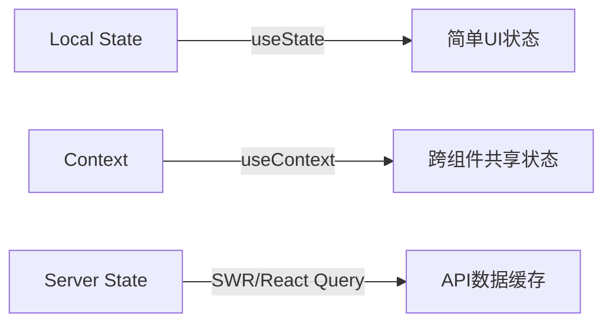

### 🧩 1. **组件设计原则**
- **原子化组件**：按 `原子（Button/Input）→ 分子（Form）→ 组织（DashboardCard）` 层级封装
- **Props 最小化**：通过 `extends ChakraProps` 继承基础属性，避免冗余定义
```tsx
// Good ✅
interface CardProps extends ChakraProps {
  title: string;
  collapsible?: boolean;
}
export const Card = ({ title, ...rest }: CardProps) => (
  <Box borderWidth="1px" borderRadius="lg" {...rest}>...</Box>
)
```

---

### ⚛️ 2. **状态管理策略**

- **优先级**：`Local State > Context > Zustand/Jotai`（避免 Redux 除非必要）

---

### 🎨 3. **主题与样式规范**
- **主题定制**：仅扩展 Saas UI 主题，不覆盖底层 Chakra
```ts
// theme/index.ts
import { extendTheme } from "@chakra-ui/react";

export default extendTheme({
  colors: {
    brand: {
      500: "#3a86ff", // 主品牌色
    },
  },
  components: {
    Button: {
      baseStyle: { fontWeight: "medium" }, // 统一按钮字重
    },
  },
});
```
- **禁止**：行内 CSS 写 `!important` 或 `px` 硬编码（使用主题 scale）

---

### 🚀 4. **性能优化点**
```tsx
// 动态导入重型组件
import dynamic from 'next/dynamic';
const Chart = dynamic(() => import('../components/Chart'), { 
  ssr: false,
  loading: () => <Skeleton height="200px" /> 
});

// 列表项优化
const ItemList = () => (
  <List>
    {items.map(item => (
      <ListItem key={item.id} render={<AutoSizer />} /> // 虚拟滚动
    ))}
  </List>
)
```

---

### 📂 5. **目录结构规范**
```bash
src/
├── app/                # Next.js App Router
├── components/         # 通用组件
│   ├── ui/             # 基础UI (Button/Card...)
│   └── dashboard/      # 业务模块组件
├── hooks/              # 自定义hooks
├── lib/                # 工具函数
├── providers/          # 全局Context提供者
├── services/           # API客户端
├── types/              # TS类型定义
└── theme/              # 主题配置
```

---

### 🔐 6. **安全与错误处理**
- **API 层**：使用 `services/` 统一封装，包含：
  ```ts
  // services/api.ts
  export async function fetchData(url: string) {
    try {
      const res = await fetch(url);
      if (!res.ok) throw new Error(`${res.status}`);
      return await res.json();
    } catch (err) {
      // 统一发送错误监控
      captureException(err);
      throw err; 
    }
  }
  ```
- **组件级**：使用 Saas UI 的 `ErrorBoundary` 包裹关键区域

---

### ✅ 7. **代码质量守则**
1. **TypeScript 严格模式**：启用 `strict: true` + `noImplicitAny`
2. **命名规范**：
   - 组件：`PascalCase` (`UserProfileCard.tsx`)
   - Props：`camelCase` + 语义化 (`showAvatar` 而非 `avt`)
3. **文档化**：为每个组件添加 JSDoc
   ```tsx
   /**
    * 仪表盘数据卡片 - 支持折叠功能
    * @param title 卡片标题
    * @param metrics 指标数据数组
    */
   export const MetricsCard = ({ title, metrics }) => ...
   ```

---

### 🌐 8. **路由最佳实践**
- **App Router**：优先使用 Server Components 处理数据
  ```tsx
  // app/dashboard/page.tsx
  export default async function Dashboard() {
    const data = await getDashboardData(); // 直接服务端获取
    return <DashboardLayout data={data} />;
  }
  ```
- **动态路由**：`[slug]/page.tsx` + `generateStaticParams()`

---

### 💡 简洁性检查清单（提交前自问）：
1. 是否删除了未使用的 props/state？  
2. 组件是否超过 200 行？（需拆解）  
3. 相同逻辑是否重复出现 3 次以上？（应抽象为 hook）  
4. 是否避免嵌套三元运算符？  
5. 所有用户操作是否有错误边界保护？

> 记住：**优雅 = 简单性 + 一致性 + 可预测性**。优先使用 Saas UI 原生能力，避免再造轮子。